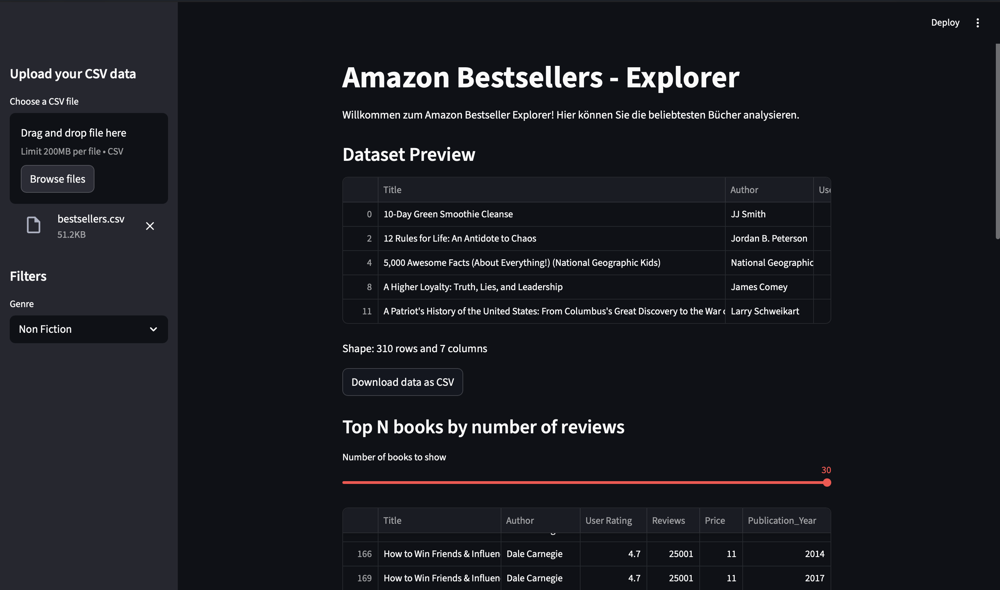
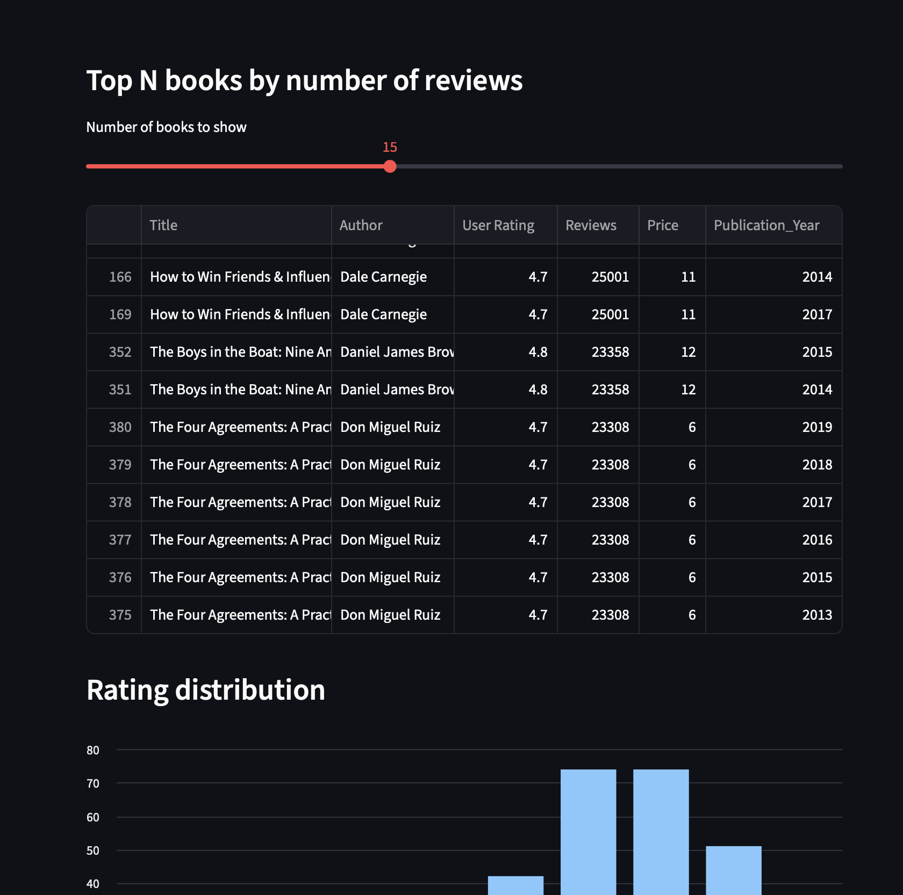
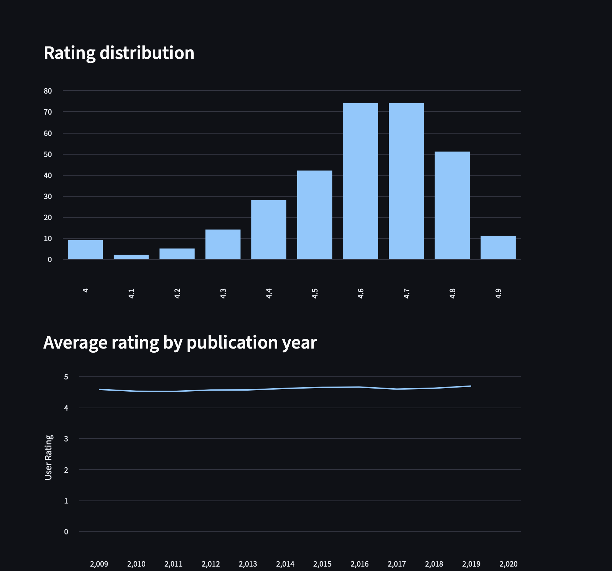

# Amazon Bestsellers Explorer

Small practice project using Python, pandas, and Streamlit to explore an Amazon bestsellers dataset from a CSV file.

The project has two parts:

- a **Streamlit web app** for interactive exploration  
- a **CLI tool** that generates CSV reports  

---

## What it does

- Loads and cleans `bestsellers.csv` (removes duplicates, renames columns, fixes types)
- Lets you **upload your own CSV** (same structure as `bestsellers.csv`)
- Filters books by **genre** in a sidebar
- Shows a **preview** of the filtered data and its shape
- Displays the **top N books by number of reviews**
- Visualizes:
  - rating distribution
  - average rating per publication year
- Allows you to **download the filtered data as CSV**
- CLI tool generates:
  - `author_counts.csv`
  - `avg_rating_by_genre.csv`
  - `avg_rating_by_year.csv`

---

## How to run

```bash
# create and activate virtual environment
python -m venv .venv
source .venv/bin/activate  # On Windows: .venv\Scripts\activate

# install dependencies
pip install -r requirements.txt

# run the Streamlit app
python -m streamlit run app.py

# run the CLI reports
python main.py --input bestsellers.csv --output outputs/
```

This will start the web app (usually at http://localhost:8501) and create CSV reports in the outputs/ directory.

---

## Screenshots

### Overview dashboard



### Top N books



### Diagrams


